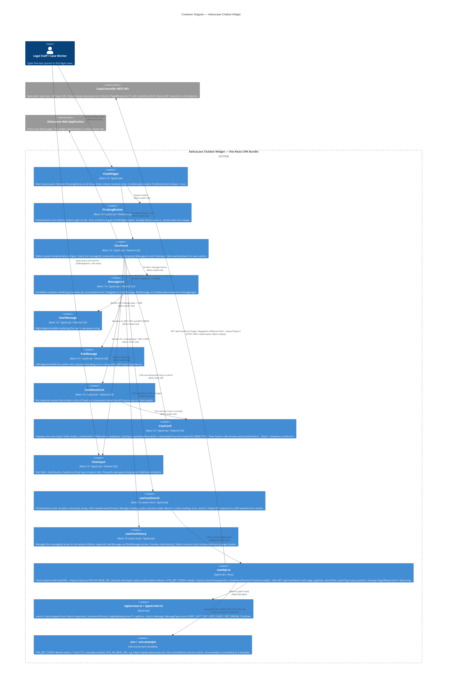

# C4 Level 2 — Container Diagram

## Aeliuscase Chatbot Widget — Internal Containers

This diagram shows the internal containers (logical building blocks) of the widget and their relationships
to the external CaseController REST API. At this scale "containers" map to distinct runtime or deployment
units, configuration boundaries, and major module responsibilities.

All field names below are derived from the actual CaseController API (`/api/Case` base path, confirmed
from `CaseController API.docx`).



---

## Container responsibilities summary

| Container | Layer | Primary responsibility |
|---|---|---|
| ChatWidget | Presentation — Root | Mount point; floating button; open/close state |
| FloatingButton | Presentation | Fixed-position chat icon; toggle trigger |
| ChatPanel | Presentation | Chat panel shell; message thread; submit dispatch |
| MessageList | Presentation | Scrollable conversation history renderer |
| UserMessage | Presentation | User query bubble |
| BotMessage | Presentation | System text response bubble (loading / error / empty) |
| CaseResultList | Presentation | Bot response variant containing case cards |
| CaseCard | Presentation | Single case result display + deep-link navigation |
| ChatInput | Presentation | Text field + Send button |
| useCaseSearch | Application | Search orchestration; loading / error / result state |
| useChatHistory | Application | Session message history management |
| caseApi.ts | Infrastructure | HTTP transport; JWT injection; URL construction |
| types/case.ts | Domain | API response type contracts |
| types/chat.ts | Domain | UI message shape contracts |
| .env | Configuration | Developer-managed runtime credentials |

---

## Confirmed API endpoints used by the widget

The widget's primary integration point is the search endpoint confirmed in `CaseController API.docx`:

| Usage | Method | Path | Key params |
|---|---|---|---|
| Case search (primary) | GET | `/api/Case/Search` | `page`, `pageSize`, `searchText`, `searchType` (2 = OpenCases) |
| Autocomplete / dropdown | GET | `/api/Case/Dropdown` | `page`, `pageSize`, `searchText` |
| Update last viewed | PUT | `/api/Case/UpdateLastView` | body: `{ id: int }` |

The `MainSearchType` enum controls scope: `1` = AllCases, `2` = OpenCases, `3` = ClosedCases, etc.
The widget defaults to `searchType=1` (AllCases) and lets the user's query text filter results.

---

## Search response field mapping

The Search endpoint (`GET /api/Case/Search`) returns `PagedResponse<T>` with the following `data[]` fields
that the widget consumes. Field names are camelCase (confirmed from docx).

| API field | Widget display | Notes |
|---|---|---|
| `id` | React list key | Numeric integer, used as `key` prop |
| `fileNumber` / `caseNumber` | Case number on card | Both exist; display `caseNumber` |
| `caseName` | Card title | e.g. "John Doe vs ABC Company" |
| `caseType` | Type badge on card | "WCAB" or "Personal Injury" |
| `caseStatusDescription` | Status badge | e.g. "Open", "Closed" |
| `createdDateTime` | "Opened" date on card | ISO 8601 datetime → format as DD MMM YYYY |
| `caseApplicant.fullName` | Applicant name on card | Available for WCAB cases |

The `caseDetailUrl` is NOT returned by the API. The widget constructs it as:
`{VITE_AELIUS_APP_BASE_URL}/cases/{id}` — a third env variable `VITE_AELIUS_APP_BASE_URL` must be
added to `.env` to support deep-link generation.

---

## Data flow — happy path

```
User types query and presses Enter
  -> ChatPanel.handleSubmit(queryString)
  -> useChatHistory.append({ type: USER, text: queryString })
  -> useCaseSearch.search(queryString)
      -> caseApi.searchCases({ page: 1, pageSize: 20, searchText: queryString, searchType: 1 })
          -> GET /api/Case/Search?page=1&pageSize=20&searchText=...&searchType=1
             Authorization: Bearer <VITE_JWT_TOKEN>
          <- PagedResponse { data: Case[], totalRecords, page, pageSize }
      <- Case[] (typed)
  -> useChatHistory.append({ type: BOT_CASES, cases: Case[] })
  -> MessageList re-renders; CaseResultList renders N CaseCard components
  -> User clicks "View" on a CaseCard
  -> window.open("https://aeliusapp.example.com/cases/9806", "_blank", "noopener,noreferrer")
```

## Data flow — 401 JWT expired

```
  -> GET /api/Case/Search → HTTP 401
  -> caseApi.ts Axios interceptor detects 401
  -> throws ApiError { code: 'JWT_EXPIRED', status: 401 }
  -> useCaseSearch sets error = { type: 'JWT_EXPIRED' }
  -> ChatPanel renders BotMessage with JWT-expiry guidance text
     "Your session token has expired. Ask a developer to update .env and restart."
```

---

## Environment variables (complete set)

| Variable | Example value | Purpose |
|---|---|---|
| `VITE_JWT_TOKEN` | `eyJhbGci...` | Bearer token; rotate every ~1 hour |
| `VITE_API_BASE_URL` | `https://uatapi.aeliuscase.com` | CaseController API base URL; no trailing slash |
| `VITE_AELIUS_APP_BASE_URL` | `https://uat.aeliuscase.com` | Aeliuscase web app base URL for constructing case deep-links |
