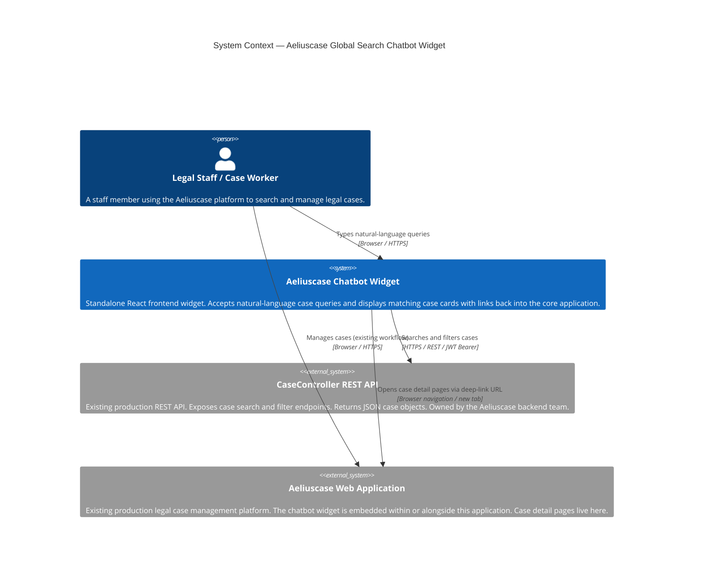

# C4 Level 1 - System Context Diagram

## Aeliuscase Global Search Chatbot Widget

This diagram shows how the chatbot widget fits into the broader ecosystem: who uses it, what external systems it depends on, and what it does not own.

## Boundary notes

| Element | Owned by this project | Notes |
|---|---|---|
| Aeliuscase Chatbot Widget | YES | The system being built. Pure frontend, no new backend. |
| CaseController REST API | NO | Provided by the backend dev team. No changes required. |
| Aeliuscase Web Application | NO | Existing platform. The widget links into it; it does not modify it. |
| Legal Staff / Case Worker | N/A | Primary user persona. Authenticated via an existing session that produces the JWT. |

## Key design constraint

The widget is a **read-only consumer** of the CaseController API. It does not write, create, or mutate case records. All mutation workflows remain inside the Aeliuscase Web Application.
